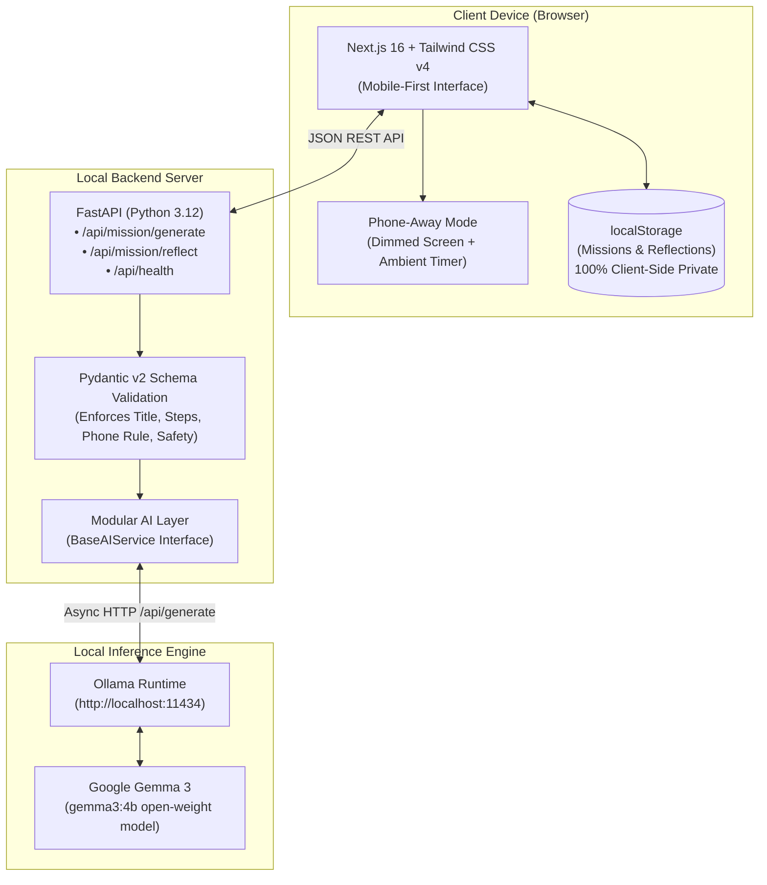

# 🌿 TouchLess AI

> **"AI that wants you to stop using it."**  
> *Built for Hacktoberfest 2026 — Open-Source AI Challenge: Week 1 — Touch Grass.*

[](LICENSE)
[](https://ai.google.dev/gemma)
[-teal.svg)](https://ollama.com)
[-black.svg)](https://nextjs.org)
[-009688.svg)](https://fastapi.tiangolo.com)

---

## 📌 The Problem

Most modern consumer AI applications are engineered around a single incentive: **maximizing your time on screen**. 

Infinite chat threads, multi-turn follow-ups, recursive suggestions, and engagement loops keep you staring at a glowing rectangle. For students and knowledge workers already glued to monitors all day, using "AI assistants" often exacerbates digital fatigue rather than alleviating it.

We don't need another chatbot that wants our continuous attention. We need technology that helps us step away.

---

## 💡 What TouchLess AI Does

**TouchLess AI** inverts typical AI design:

> **The better TouchLess works, the sooner you stop looking at the screen.**

Instead of open-ended conversational banter, TouchLess takes your basic constraints (time available, nearby environment, desired mood, and difficulty) and uses **Google Gemma 3** to architect a concrete, safe, and sensory outdoor mission. 

Once your mission is generated:
1. You read 3–5 simple real-world instructions.
2. The app transitions into **Phone-Away Mode** — a deeply dimmed, ambient rest screen with a discreet timer.
3. You put your phone into your pocket or bag and head outside.
4. When you return, you write a brief single-sentence observation.
5. Gemma generates a short, grounding reflection (2–3 sentences max) affirming your real-world presence — and closes the loop without asking open-ended questions or encouraging endless chatter.

---

## 🔄 Core User Flow

```
Open App
   ↓
Select Constraints (5–60m • Park/Trail/Neighborhood • Mood • Difficulty)
   ↓
Generate Mission with Gemma 3
   ↓
Read Concrete Steps & Phone Rule
   ↓
Enter Phone-Away Mode (Screen at rest)
   ↓
PUT PHONE IN POCKET & GO OUTSIDE
   ↓
Complete Mission in the Real World
   ↓
Return & Record 1-Sentence Experience
   ↓
Receive Short Gemma 3 Reflection
   ↓
Saved Privately to LocalStorage (No Accounts, No Tracking)
```

---

## 🏗️ Architecture



### ⚠️ Note on Offline Behavior vs. AI Generation
- **Client State & History**: The web frontend caches past missions and computes statistics completely offline in browser `localStorage`.
- **AI Generation**: Generating a new mission or post-mission reflection requires local inference via the **FastAPI backend + Ollama running Gemma 3** (or a self-hosted backend). TouchLess AI does **not** claim to run multi-billion parameter LLMs client-side in WebGPU — it runs local inference through your local Ollama instance with zero third-party API dependencies.

---

## 🌟 Key Features

### 1. Distraction-Free Landing & Health Telemetry
- Communicates the project philosophy immediately: *"Get a small mission. Go outside. Come back different."*
- Real-time probe to the backend indicating whether Gemma 3 and Ollama are reachable and healthy.
- Subtle offline stats preview (missions completed and minutes spent outside) that never distracts from the core call-to-action.

### 2. Thumb-Friendly Mission Setup
- Pure pill-button interface optimized for single-handed mobile use (no cumbersome dropdowns or keyboards needed).
- Select duration: `5 min`, `10 min`, `15 min` (default), `30 min`, `60 min`.
- Select environment: `Anywhere`, `Neighborhood`, `Park`, `Garden`, `Trail`, `Campus`.
- Select mood/goal: `Explore`, `Relax`, `Exercise`, `Observe Nature`, `Be Creative`, `Clear My Head`, `Surprise Me`.
- Select difficulty: `Easy`, `Normal`, `Adventurous`.

### 3. Structured Outdoor Mission Cards
- Clear, readable typography designed for quick scanning before putting your phone away.
- Step-by-step physical instructions (walk slowly, notice ignored sounds, find textures).
- Mandatory **Phone Rule** (e.g., *"Put your phone in your pocket or backpack after reading this"*).
- Practical **Safety Guideline** (stay on marked pedestrian sidewalks, respect daylight).
- Optional **Bonus Constraint** (e.g., notice 5 different shades of green, leave headphones behind).

### 4. Immersive Phone-Away Mode (Core Feature)
- Dedicated distraction-free screen mode that dims the display into an ambient OLED-friendly dark palette (`#020503`).
- Luminous breathing bio-orb with smooth natural pulsation.
- Clean elapsed time counter showing how many minutes you have been disconnected from screens.
- Prominent reminder: *"You're supposed to be outside. Put your phone away."*
- Peeking at the mission is intentionally demoted to a subtle secondary link to encourage keeping your phone in your pocket.

### 5. Grounding Post-Mission Reflection
- When you return from outside, enter 1 simple sentence about what you noticed or felt.
- Gemma 3 generates a warm, mindful 2–3 sentence reflection acknowledging your time disconnected.
- Does not ask open-ended questions or attempt to trap you in an ongoing conversation.

### 6. Private Local History
- All completed activities, timestamps, observations, and Gemma reflections are saved in browser `localStorage`.
- Zero user authentication, zero cookies, zero external databases, zero tracking.
- Aggregate stats: total missions completed, total offline time, favorite outdoor habitat.
- Complete data ownership: one-click mission deletion or complete history wipe.

---

## 🧠 Why Google Gemma 3 & Ollama?

1. **Open-Weight Autonomy**: Google Gemma 3 offers state-of-the-art instruction following and reasoning in a lightweight footprint (`gemma3:4b`).
2. **Local Inference with Ollama**: Running through Ollama means TouchLess AI requires **no OpenAI/Anthropic API keys**, incurs **zero per-token billing**, and ensures that your outdoor reflections never leave your machine.
3. **Structured JSON Output**: Gemma 3 excels at adhering to strict JSON schemas, allowing the backend Pydantic models to validate titles, step counts, phone rules, and safety constraints deterministically.
4. **Modular Architecture**: The AI integration is isolated behind an abstract `BaseAIService` interface (`backend/services/base.py`), enabling other local models (e.g., Gemma 2, Llama 3) or alternative local engines (e.g., vLLM) to be swapped in effortlessly.

---

## 💻 Tech Stack

- **Frontend**: Next.js 16 (App Router), React 19, TypeScript, Tailwind CSS v4, Lucide Icons
- **Backend**: FastAPI, Python 3.12, Pydantic v2, HTTPX Async Client, Uvicorn
- **AI Model**: Google Gemma 3 (`gemma3:4b`) via Ollama
- **Storage**: Browser `localStorage` (100% private, client-side only)
- **Containerization**: Multi-service Dockerfile & `docker-compose.yml`

---

## 🚀 Complete Local Setup Instructions

### 1. Prerequisites
- **Ollama**: [Download & install Ollama](https://ollama.com/download)
- **Python**: 3.11+ or 3.12+
- **Node.js**: v20+ or v24+ (with npm)
- **Git**

---

### 2. Ollama & Gemma Setup

Open a terminal to download the Gemma 3 model and verify Ollama is serving:

```bash
# Pull Google Gemma 3 (4B parameter quantized model, ~3.3 GB)
ollama pull gemma3:4b

# Verify the model is downloaded
ollama list

# Ensure Ollama server is running (defaults to http://localhost:11434)
ollama serve
```

---

### 3. Backend Setup (FastAPI)

In a new terminal window:

```bash
# 1. Navigate to the backend directory
cd backend

# 2. Create and activate a Python virtual environment
# Windows PowerShell:
python -m venv .venv
.\.venv\Scripts\Activate.ps1
# macOS / Linux:
python3 -m venv .venv
source .venv/bin/activate

# 3. Install dependencies
pip install -r requirements.txt

# 4. Start the FastAPI development server
uvicorn main:app --reload --port 8000
```

The API will now be listening at **`http://localhost:8000`**.  
Interactive Swagger docs: **`http://localhost:8000/docs`**.

---

### 4. Frontend Setup (Next.js)

In another terminal window:

```bash
# 1. Navigate to the frontend directory
cd frontend

# 2. Install dependencies
npm install

# 3. Start the Next.js development server
npm run dev
```

Open **`http://localhost:3000`** in your browser (or open from a phone connected to the same local Wi-Fi).

---

### 5. Running with Docker Compose (Optional)

If you prefer containerized execution:

```bash
docker-compose up --build
```

---

## 📡 API Endpoints

### 1. Health Check
`GET /api/health`

Verifies backend liveness and probes whether Ollama and the requested Gemma model are ready.

**Response:**
```json
{
  "status": "healthy",
  "service": "touchless-ai-backend",
  "provider": "ollama",
  "model": "gemma3:4b",
  "ollama_ready": true,
  "detail": "Ollama is healthy. Model 'gemma3:4b' is ready."
}
```

### 2. Generate Outdoor Mission
`POST /api/mission/generate`

**Request Body:**
```json
{
  "duration": 15,
  "environment": "Park",
  "goal": "Observe Nature",
  "difficulty": "normal"
}
```

**Response (Validated by Pydantic):**
```json
{
  "id": "485a21e3-8de0-443a-90dc-06da14d55476",
  "title": "Park Observation: 15 Minutes",
  "duration": 15,
  "environment": "Park",
  "goal": "Observe Nature",
  "difficulty": "normal",
  "instructions": [
    "Find a quiet spot in the park.",
    "Spend 5 minutes focusing on the trees – their shapes, colors, and textures.",
    "Next, observe the ground – the plants, leaves, and any small creatures you can spot.",
    "Finally, listen to the sounds of the park for the remaining 5 minutes – birds, wind, and human activity.",
    "Take a moment to appreciate the details around you."
  ],
  "challenge": "Notice five different shades of green.",
  "phone_rule": "Put your phone in your pocket or bag after reading this.",
  "safety": "Be aware of your surroundings and others in the park.",
  "created_at": "2026-10-07T19:13:05.090289+00:00"
}
```

### 3. Post-Mission Reflection
`POST /api/mission/reflect`

**Request Body:**
```json
{
  "mission_title": "Park Observation: 15 Minutes",
  "user_experience": "I sat near an oak tree and noticed the smell of damp pine needles and birds singing."
}
```

**Response:**
```json
{
  "reflection": "It’s wonderful that you took the time to reconnect with nature. Allowing yourself this quiet observation was a valuable reset, reminding us of the simple beauty and calm that exists beyond our screens. Let’s carry that sense of peace into the rest of your day."
}
```

---

## 📁 Project Structure

```
touchless-AI/
├── .env.example                     # Environment template
├── .gitignore                       # Clean repository ignore patterns
├── README.md                        # Documentation & setup guide
├── docker-compose.yml               # Multi-container orchestration
│
├── backend/
│   ├── main.py                      # FastAPI app entry with CORS & health endpoint
│   ├── config.py                    # App configuration loaded via Pydantic
│   ├── requirements.txt             # Minimal dependencies (FastAPI, Uvicorn, Pydantic, HTTPX)
│   ├── Dockerfile                   # Backend Docker containerfile
│   ├── .env.example                 # Backend environment variable template
│   ├── run_validation_tests.py      # Automated 10-point test suite for Gemma 3 & API
│   ├── models/
│   │   ├── __init__.py
│   │   └── mission.py               # Pydantic schemas (MissionRequest, GemmaMissionOutput, etc.)
│   ├── prompts/
│   │   ├── __init__.py
│   │   └── mission.py               # Mission designer & reflection prompt builders
│   ├── services/
│   │   ├── __init__.py              # Dependency injector (get_ai_service)
│   │   ├── base.py                  # Abstract BaseAIService class
│   │   └── ollama.py                # Ollama client with JSON parsing & timeout handling
│   └── routes/
│       ├── __init__.py
│       └── mission.py               # Router for /api/mission/generate & /api/mission/reflect
│
└── frontend/
    ├── package.json                 # Next.js 16, React 19, Tailwind CSS v4, Lucide
    ├── tsconfig.json                # TypeScript compiler configuration
    ├── next.config.ts               # Next.js runtime configuration
    ├── Dockerfile                   # Frontend Docker containerfile
    ├── .env.local                   # NEXT_PUBLIC_API_URL=http://localhost:8000
    ├── lib/
    │   ├── api.ts                   # Fetch API client with network diagnostics
    │   └── storage.ts               # Safe localStorage helpers & stats calculator
    ├── types/
    │   └── mission.ts               # TypeScript data types
    └── app/
        ├── layout.tsx               # Root layout: viewport, navbar, health badge, footer
        ├── globals.css              # Nature palette, breathing pulse, reduced-motion rules
        ├── page.tsx                 # 1. Landing Page
        ├── mission/
        │   ├── setup/page.tsx       # 2. Mission Setup (Pill selectors)
        │   └── [id]/page.tsx        # 3. Mission Display, 4. Phone-Away Mode, 5. Reflection
        └── history/page.tsx         # 6. History & Stats Dashboard
```

---

## 📸 Screenshots

*(Replace placeholders with actual UI screenshots upon deployment)*

| Landing Page | Mission Setup |
|---|---|
|  |  |

| Mission Card | Phone-Away Mode |
|---|---|
|  |  |

---

## 🎥 Demo Video

- **Demo Video URL**: *[Coming soon / Demo link placeholder]*
- **Live Local Demo**: Run locally via `http://localhost:3000` with Ollama running `gemma3:4b`.

---

## 🤝 Contributing

We welcome contributions during Hacktoberfest and beyond!

1. Fork the repository.
2. Create a new branch: `git checkout -b feature/your-feature-name`.
3. Test your changes:
   - Backend: `python -u run_validation_tests.py`
   - Frontend: `npm run build`
4. Commit your changes: `git commit -m "feat: describe your change"`.
5. Push to your branch and submit a Pull Request.

### Suggested Good First Issues:
- Add seasonal or weather-aware prompt tags (e.g. Rainy Day, Winter Snow).
- Add support for exporting mission logs as simple Markdown files.
- Add audio cues (e.g. gentle nature bell sound on mission completion).
- Enhance mobile PWA install manifest.

---

## ⚖️ Why Open-Source & Open-Weight AI Matters

Most proprietary AI APIs operate as centralized black boxes:
- Every prompt and private thought is logged on third-party servers.
- Models change or get deprecated without warning.
- Users are tracked and monetized based on active session time.

TouchLess AI is fundamentally an experiment in **ethical AI architecture**:
- **Privacy by Default**: Reflections about your mental health and outdoor thoughts are processed entirely on your hardware and stored only in your browser.
- **Independence**: Works completely offline from external corporate APIs.
- **Aligned Incentives**: The software doesn't have advertisements, engagement metrics, or retention loops. Its only success metric is how quickly you put your phone away.

---

## ⚠️ Known Limitations

1. **CPU Inference Latency**: Running `gemma3:4b` on consumer CPUs without dedicated GPU acceleration typically takes 20–45 seconds per generation. The setup form provides an ambient breathing state while the model generates your mission.
2. **Model Availability**: Ollama must be running with `gemma3:4b` pulled for mission generation. If Ollama is closed, the app displays a clear diagnostic warning directing you to run `ollama serve`.
3. **Browser Storage Scope**: Mission history is saved in browser `localStorage`. Clearing browser data or opening in Incognito mode will start a fresh local history.

---

## 🔮 Future Improvements

- **Progressive Web App (PWA)**: Add offline service worker for instant mobile app installation.
- **Haptic Feedback**: Gentle vibration patterns on mobile when Phone-Away Mode begins or ends.
- **Audio Soundscapes**: Optional offline binaural bird or rain sound when returning.
- **Expanded Local Models**: One-click toggle between Gemma 3 4B, Gemma 3 1B (ultra-fast for low-end hardware), and Gemma 3 12B.

---

## 🍂 Hacktoberfest 2026 Context

- **Category**: Open-Source AI Challenge
- **Theme**: Week 1 — Touch Grass
- **Philosophy**: Using open-weight AI to reduce screen dependency and reconnect with nature.

---

## 📄 License

This project is licensed under the [MIT License](LICENSE).
